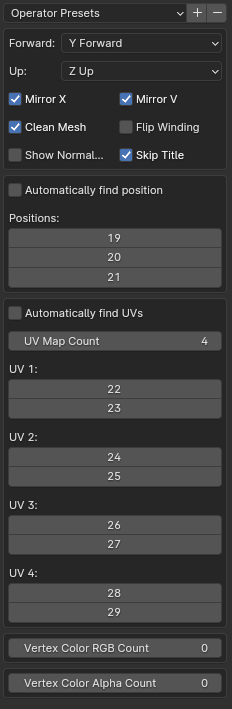

## Added in this fork
- Multiple file import:
- - You can now shift select and import multiple csv files at once
- Autmatic detection of certain parameters
- - Vertex position is able to be auto detectable (Developed for NSight exports)
- - Same as with UV maps

# CSV Importer

While created for Renderdoc .csv files, this is intended to be a general-purpose .csv mesh importer. It will assume vertex indicies as the row number, and crate faces based on that. All options on the import panel have descriptive tooltips.

To install, download the latest release and install it as an addon

# Supported Mesh Data

* Position
* Normal
* UV Maps (up to 5)
* Vertex Colors (up to 5)

# Import Options Screenshot

In each category, specify the index (0-based) in the .csv for each column of data.

Not pictured: the extra options when the "Show Normalize" is checked. This will add an extra field to each category that will divide input values by a number; "normalizing" the data.